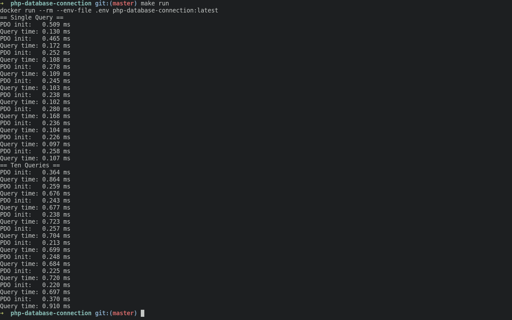
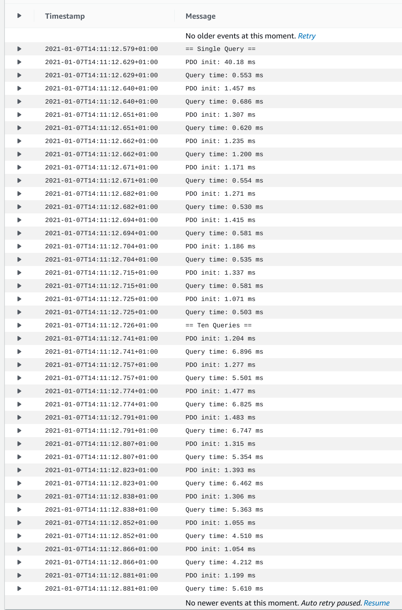
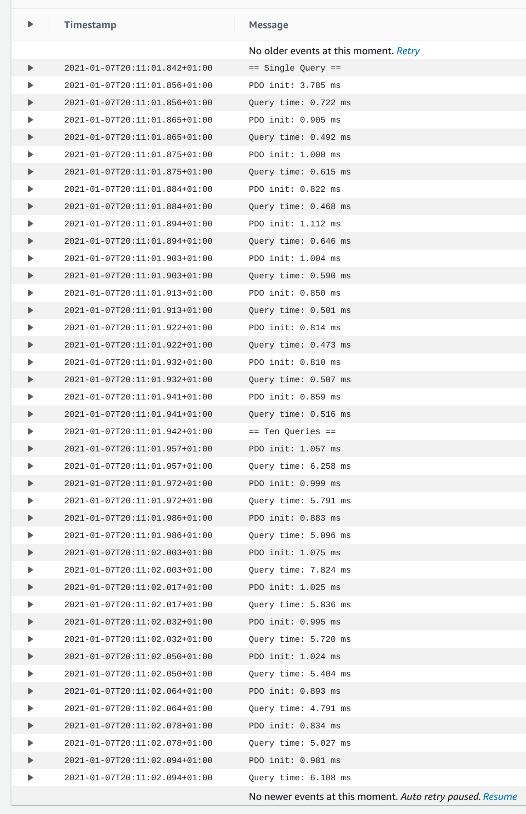
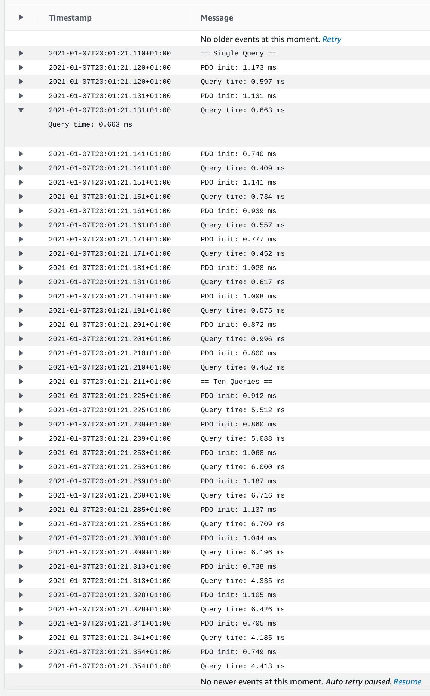
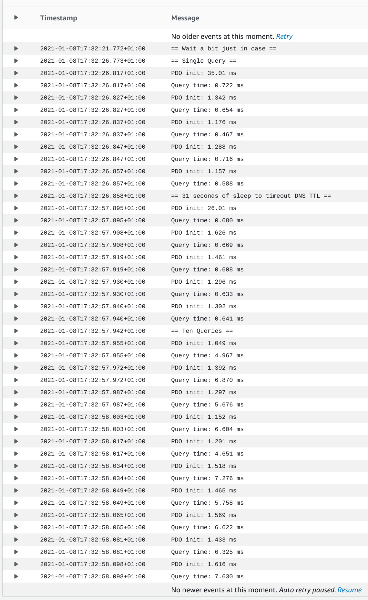
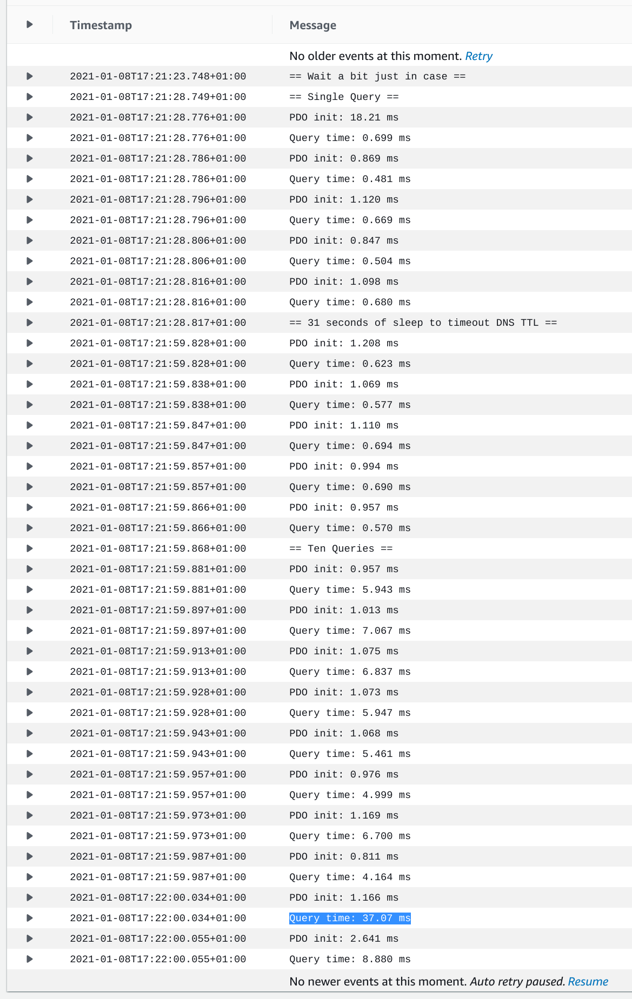
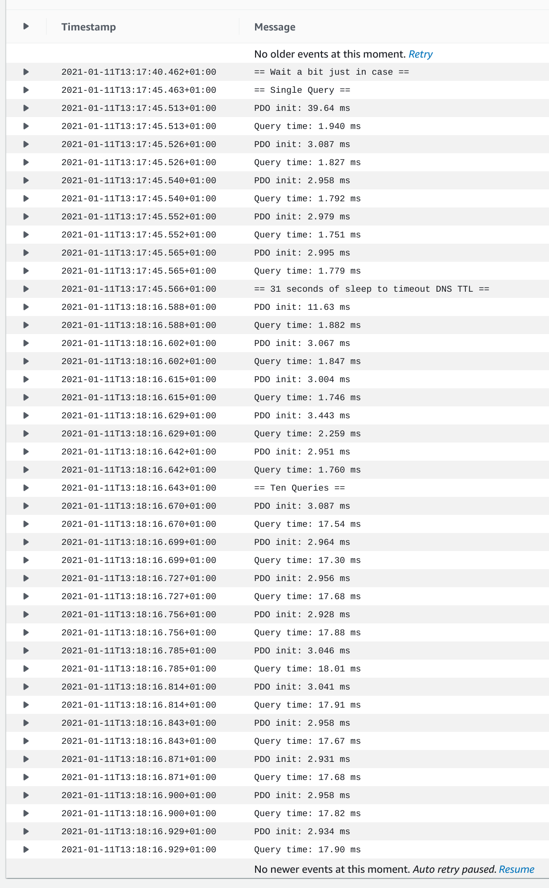
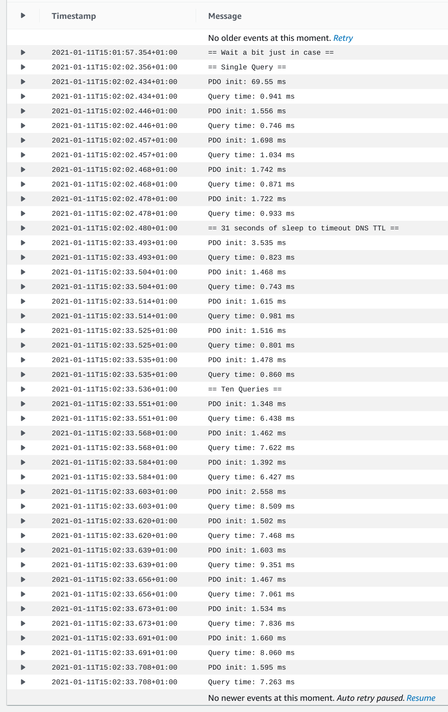

# There is Makefile ;)
# Copy .env.example as .env
# Test results available in /images
# Configuration
## local -> cli and database in separate docker containers on same machine
## fargate -> cli running in fargate container, rds in same AZ
### fargate container/task:
#### 2vCPU -> should equal one physical core
#### 4G of ram -> minimum required for CPU
### rds
#### db.m5.large
#### disabled public access, so hopefully it's routed internally
### AZ
#### us-east-a1, both in same VPC
# Example output

# Fargate CLI (DNS Endpoint) results (first entry is most significant)
## Worst case

## Average case

## Best case

# Fargate CLI (Private DNS) -> Similar to DNS Endpoint

# Fargate CLI (Private IP) results (first entry is most significant)
## Worst case

## Average case

## Best case

# Fargate CLI (DNS Endpoint) with sleep to wait out DNS cache TTL
## DNS TTL seems to be about 5-6 seconds, resolve time starts at about 3ms, usually under 40, in rare instances takes much longer.

# Extras
## this doesn't make too much sense

## latency across subnets in same region (1a to 1b)

## Running tests against a cheap RDS (T3 micro)
